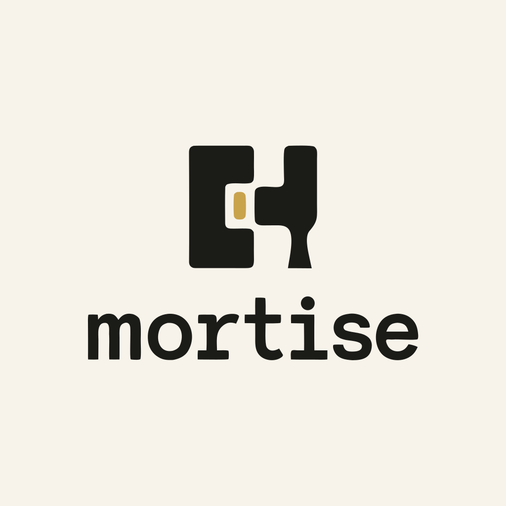

<p align="center">
  
</p>

<h1 align="center">Mortise</h1>

<p align="center">
  <em>Dark-timber agentic coding tool — a phase-aware agent loop with a terminal-native UI.</em>
</p>

<p align="center">
  <a href="https://github.com/AzeemWorsdorfer/Mortise/actions/workflows/ci.yml">
    
  </a>
  
  
  
  
</p>

## What is Mortise?

Mortise is a coding agent built from first principles. A **Go daemon** (`mortised`)
owns all state — the agent loop, tool execution, sessions, and event broadcast —
while a **TypeScript TUI** (Ink + React) renders it as a live terminal dashboard
and forwards user commands. The two halves talk over a typed **Protobuf protocol**
wrapped in Connect-RPC, over a Unix domain socket locally.

The agent runs a phase-aware loop — `Idle → Planning → Acting → Observing →
Deciding` — that broadcasts every transition to the UI, so you watch the agent
think and act in real time.

## Why Mortise?

Mortise is my hands-on project for learning Go and levelling up TypeScript: I
designed the protocol, built the state machine, wired the transport, and shipped
the UI myself. Along the way the project picked up the engineering habits that
make it a real product rather than a toy — a tracked ticket backlog with
acceptance criteria, ADR-style domain docs, full CI, and branch discipline.

## Features

Implemented:

- **Phase-aware agent loop** — a state machine (`Idle → Planning → Acting →
Observing → Deciding`) with pause/cancel and structured error transitions.
- **Thin-client architecture** — the daemon is the single source of truth; the
  TUI is a renderer, not a brain.
- **Typed wire protocol** — Protobuf `ServerEvent` envelopes with phase context,
  generated stubs for Go and TypeScript via `buf`.
- **Event bus** — pub/sub broadcast of phase changes, thinking chunks, and tool
  status to every connected client.
- **SQLite session store** — pure-Go driver (`modernc.org/sqlite`, no CGO),
  sessions persist across daemon restarts.
- **Offline development** — the TUI runs standalone on a mock provider
  (`--mock`), and the daemon ships a mock agent provider for tests.
- **Versioned project config** — `.mortise.json` with per-project overrides.
- **Enforced quality** — golangci-lint, `go vet`, `gofmt`, Prettier, `tsc`, a
  proto-staleness check, and Husky pre-commit hooks; all gated in CI.

Planned next (tracked as tickets in `.scratch/`): a real tool layer (file
read/write/diff, shell, git), an approval gate, an interrupt system, JSONL event
logging and conversation persistence, crash recovery, and the full TUI
dashboard. See [Roadmap](#roadmap).

## Architecture

```
┌──────────────────────┐      ServerEvents (Protobuf)      ┌──────────────────────────┐
│    TUI client (TS)   │  ◄──────────────────────────────► │  Daemon `mortised` (Go)  │
│    Ink + React       │      ClientCommands               │   single source of truth │
│  --mock mode, no     │       (Connect-RPC)               │                          │
│  daemon required     │    over Unix domain socket        │  agent loop · event bus  │
└──────────────────────┘                                   │  sessions · config       │
                                                           └────────────┬─────────────┘
                                                                        │ SQLite
                                                            ┌───────────▼─────────────┐
                                                            │   ~/.mortise/           │
                                                            │  session store · socket │
                                                            └─────────────────────────┘
```

## Tech stack

| Layer    | Choice                                               |
| -------- | ---------------------------------------------------- |
| Daemon   | Go 1.26+, Connect-RPC, `modernc.org/sqlite`          |
| TUI      | TypeScript, Ink (React), `tsx`                       |
| Protocol | Protobuf, generated with `buf`                       |
| Quality  | golangci-lint, `go vet`, Prettier, Husky             |
| CI       | GitHub Actions (`go-lint`, `ts-lint`, `proto-check`) |

## Repository layout

```
Mortise/
├── assets/                # Brand assets (logo SVG + PNG)
├── proto/
│   └── mortise/v1/        # Source of truth for the wire format
├── daemon/                # Go daemon (binary: mortised)
│   ├── agent/             # Agent loop state machine + providers
│   ├── daemon/            # Server, socket, event bus, RPC handler
│   ├── session/           # Session lifecycle + SQLite store
│   ├── config/            # .mortise.json loading/merging
│   └── gen/               # Generated proto stubs (committed)
├── tui/                   # TypeScript client (Ink + React)
│   ├── src/
│   │   ├── components/    # StatusPanel etc.
│   │   └── gen/           # Generated proto stubs (committed)
├── docs/                  # Specs and agent docs
├── .github/workflows/     # CI
├── .husky/                # Pre-commit hooks
├── scripts/               # Repo-wide check scripts
├── Makefile               # Top-level build / lint / test
└── package.json           # Node tooling (proto plugins, lint, etc.)
```

## Getting started

### Prerequisites

- Go 1.26+ (CI runs 1.26.5)
- Node 22+
- `protoc` (`brew install protobuf`)
- `buf`, `protoc-gen-go`, `protoc-gen-connect-go`, `golangci-lint` — installed
  automatically by `make bootstrap`

### Quick start

```bash
make bootstrap       # install Go toolchain + npm deps
make build           # compile the daemon into ./bin/mortised

# Terminal 1 — run the daemon (binds ~/.mortise/mortise.sock by default)
./bin/mortised

# Terminal 2 — connect the TUI client
npm run tui:start

# No daemon handy? The TUI runs standalone on fake data:
npm run tui:mock
```

### Day-to-day

```bash
make proto           # regenerate Go + TypeScript stubs from proto/
make ci              # full CI pipeline: proto-check + format-check + lint + test + build
make lint            # all linters (TS + Go)
make format          # auto-format all sources
make test            # all tests
```

### Pre-commit

The Husky pre-commit hook runs automatically on `git commit`:

1. **lint-staged** — per-file prettier, eslint, gofmt, buf format
2. **Repo-wide checks** — secret scan, conflict-marker scan, file-size cap
   (1 MB), proto-staleness check

Run it manually with `bash .husky/pre-commit`; bypass with
`git commit --no-verify` (use sparingly).

## Roadmap

Implementation is tracked as numbered tickets with acceptance checklists under
`.scratch/core-agent-harness/issues/`.

| Stage     | Scope                                                                                                                                                                                          |
| --------- | ---------------------------------------------------------------------------------------------------------------------------------------------------------------------------------------------- |
| ✅ Done   | Project foundation, Go daemon scaffold, TS TUI scaffold, session + event bus, agent loop (mock provider)                                                                                       |
| 🔨 Queued | Tool interface & file read/write/diff, shell + git tools, approval gate, interrupt system, SQLite conversations + JSONL event log, crash recovery, project context loading, full TUI dashboard |
| 🔭 Future | Provider agnosticism, observability, session handoff, collaboration                                                                                                                            |

## Branching

- `main` — production. Merges only from `develop` via PR; protected on GitHub.
- `develop` — integration. Feature branches merge here via PR; protected.
- `feature/NN-short-slug` — a single ticket's work (e.g. `feature/06-agent-loop-mock-provider`).

Both branches require a green CI run (`go-lint`, `ts-lint`, `proto-check`) to
merge; history is linear, with no force-push or admin bypass.

## Documentation

- `CONTEXT.md` — domain glossary (daemon, TUI, agent loop, protocol terms)
- `docs/specs/01-core-agent-harness.md` — the foundational spec
- `AGENTS.md` — agent instructions for this repo
